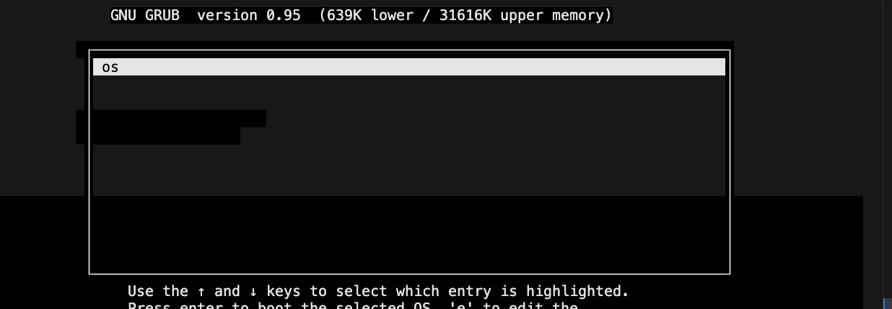
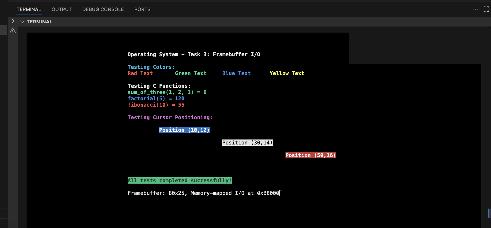

# Operating System Development - Static Framebuffer Demo

## Implementation Overview
This project implements a basic operating system kernel with framebuffer I/O functionality. The system demonstrates VGA text mode programming, mathematical function execution, and colored text display output.


*Screenshot: System boot sequence*

## Project Structure

```
worksheet2_part1/
├── drivers/                    # Hardware abstraction layer
│   ├── framebuffer.h          # Framebuffer API declarations
│   ├── framebuffer.c          # VGA text mode driver implementation
│   └── io.asm                 # Low-level I/O port assembly functions
├── source/
│   ├── loader.asm             # Bootstrap assembly → C transition
│   ├── kernel.c               # Main C kernel with framebuffer testing
│   └── link.ld                # Custom ELF linker script
├── iso/                       # Bootable image structure
│   └── boot/grub/
│       ├── menu.lst           # GRUB configuration
│       ├── stage2_eltorito    # GRUB bootloader
│       └── kernel.elf         # Compiled kernel (generated)
├── Makefile                   # Build system
├── os.iso                     # Final bootable ISO (generated)
└── logQ.txt                   # QEMU execution log (generated)
```
## Build and Run Instructions

### Build the Operating System
```bash
make clean && make
```

### Run in Standard Mode
```bash
make run
### Run with Framebuffer Graphics
```bash
make run-curses
```

**To quit curses mode:**
```bash
# In another terminal:
telnet localhost 45454
(qemu) quit
```

### Verify Execution
```bash
make check-log
```

## Implementation Details

### Framebuffer Driver Implementation

#### Memory-Mapped I/O
```c
#define FB_ADDRESS 0x000B8000  // VGA text mode framebuffer

void fb_write_cell(unsigned int i, char c, unsigned char fg, unsigned char bg) {
    char *fb = (char *) FB_ADDRESS;
    fb[i] = c;                              // Character byte
    fb[i + 1] = ((bg & 0x0F) << 4) | (fg & 0x0F);  // Color attribute
}
```

#### I/O Port Control for Cursor
```c
extern void outb(unsigned short port, unsigned char data);

void fb_move_cursor(unsigned short x, unsigned short y) {
    unsigned short pos = y * FB_WIDTH + x;
    outb(FB_COMMAND_PORT, FB_HIGH_BYTE_COMMAND);  // 0x3D4
    outb(FB_DATA_PORT, (pos >> 8) & 0xFF);        // 0x3D5
    outb(FB_COMMAND_PORT, FB_LOW_BYTE_COMMAND);
    outb(FB_DATA_PORT, pos & 0xFF);
}
```

### Assembly-C Integration

#### Bootstrap Sequence
```assembly
loader:
    mov eax, 0xCAFEBABE                    ; Initial marker
    mov esp, kernel_stack + KERNEL_STACK_SIZE  ; Stack setup
    call kmain                             ; Jump to C code
    jmp .loop                              ; Infinite loop
```

#### Multiboot Header
```assembly
MAGIC_NUMBER equ 0x1BADB002
FLAGS        equ 0x0
CHECKSUM     equ -MAGIC_NUMBER

section .text:
    align 4
    dd MAGIC_NUMBER    ; Required by GRUB
    dd FLAGS
    dd CHECKSUM
```

### Mathematical Function Testing Implementation
```c
void kmain(void) {
    int sum_result = sum_of_three(1, 2, 3);     // Expected: 6
    int fact_result = factorial(5);              // Expected: 120  
    int fib_result = fibonacci(10);              // Expected: 55
    
    // Display results using framebuffer API
    fb_write_string("sum_of_three(1, 2, 3) = ", FB_LIGHT_GREEN, FB_BLACK);
    fb_write_number(sum_result, FB_LIGHT_GREEN, FB_BLACK);
    
    // Success verification
    if (sum_result == 6 && fact_result == 120 && fib_result == 55) {
        asm volatile("mov $0xDEADBEEF, %eax");  // Success marker
    }
}
```

### Number Display Implementation
```c
void fb_write_number(int num, unsigned char fg, unsigned char bg) {
    char buffer[12];
    int i = 0;
    
    if (num == 0) { fb_write_char('0', fg, bg); return; }
    
    while (num > 0) {
        buffer[i++] = '0' + (num % 10);
        num /= 10;
    }
    
    while (i > 0) { fb_write_char(buffer[--i], fg, bg); }
}
```

### Build System Implementation
```makefile
# Assembly compilation
$(LOADER_OBJ): $(LOADER_ASM)
    $(NASM) -f elf $(LOADER_ASM) -o $(LOADER_OBJ)

# C compilation with freestanding flags
$(KERNEL_OBJ): $(KERNEL_C)
    $(GCC) $(CFLAGS) $(KERNEL_C) -o $(KERNEL_OBJ)

# Linking with custom script
$(KERNEL_ELF): $(LOADER_OBJ) $(KERNEL_OBJ) $(FRAMEBUFFER_OBJ) $(IO_OBJ)
    $(LD) -T $(LINKER_SCRIPT) -melf_i386 $^ -o $@
```

## Testing and Verification

### Boot Sequence Verification
1. GRUB loading: Bootloader finds and loads kernel
2. Multiboot header: `[Multiboot-elf, <0x100000:0x9ca:0x0>]` message
3. Memory layout: Code loaded at correct 1MB address
4. C function execution: All mathematical functions return correct values
5. Success indicator: EAX register contains `deadbeef`

### Mathematical Function Results
```
sum_of_three(1, 2, 3) = 6      [Correct]
factorial(5) = 120             [Correct]  
fibonacci(10) = 55             [Correct]
```

*Screenshot: Complete framebuffer display showing all implemented features*
